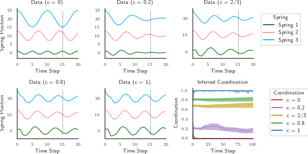
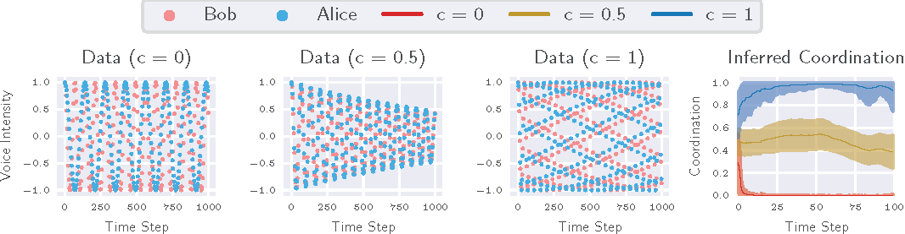

# Probabilistic Modeling of Coordination

## Requirements

To install requirements:

```setup
pip install -r requirements.txt
```

**Note**: To evaluate multiple experiments in parallel (see Inference > Vocalic Model) with the vocalic models, you must have TMUX and Conda installed in the machine and the dependencies above installed in a conda environment called `coordination`.

## Modules

The project splits the general model definition into several modules that are put together to construct a concrete instance of a model of coordination. For example, to create a model with a SerialComponent, one can use the modules: Coordination, SerialComponent, and SerialObservation (see VocalicModel). The available list of modules are:

- **Coordination**: Coordination with transitions defined by a Gaussian random walk and bounded version $\tilde{C}$.
- **SerialComponent**: Serial component with dynamics defined by a Gaussian random walk on blended means (pairwise dependency).
- **NonSerialComponent**: Non-serial component with dynamics defined by a Gaussian random walk on blended means (multiple dependencies).
- **SerialObservation**: Gaussian distribution centered on SerialComponent values
- **NonSerialObservation**: Gaussian distribution centered on NonSerialComponent values
- **SpikeObservation**: Bernoulli distribution weighted by coordination value. Used for sparse binary observations (e.g., semantic link).
- **SerialMassSpringDamperComponent**: Serial component with dynamics defined by a Hookean spring system with blended states (pairwise dependency).
- **SerialMassSpringDamperComponent**: Non-serial component with dynamics defined by a Hookean spring system with blended states (multiple dependencies).

## Models

The project contains 4 different models that can be used to generate data and run inference.

- **SpringModel**: Models coordination as controlling the influence of one spring dynamics on other spring dynamics in a mass-spring-damper system.
- **ArgumentModel**: Models coordination as controlling the influence of voice intensity from one person on another person's voice intensity, simulating an argument between a romantic couple.
- **VocalicModel**: Models coordination as controlling the influence of vocalic features from one person on another person's vocalic features during a conversation.
- **VocalicSemanticModel**: Adds semantic links to the VocalicModel to evidence moments of increased coordination.

## Synthetic Data

To reproduce the results with synthetic data, execute the commands in the notebook: `notebooks/Synthetic Data`.

### Spring Model


### Argument Model


## Inference

### Vocalic Model

To reproduce the results with the vocalic model, run this command from the `scripts` folder:

```parallel_inference
python run_usar_parallel_inference.py --tmux_session_name="vocalic" --num_parallel_processes=<number_of_experiments_in_parallel> --out_dir=<path-to-save-results> --evidence_filepath=<path-to-data> --model="vocalic" --burn_in=2000 --num_samples=2000 --num_chains=4 --seed=0 --num_inference_jobs=4 --do_prior=0 --do_posterior=1 --vocalic_features="all" --self_dependent=1 --share_mean_a0_across_subject=0 --share_sd_aa_across_subject=1 --share_sd_o_across_subject=1 share_sd_o_across_features=1 --sd_o_vocalic=0.1 --sd_uc=0.5
```

**Note**: The script above will run multiple experiments in parallel. See **Requirements** for details on configuration. Suppose one wants to do inference for a subset of experiments. In that case, it is possible to do so without the configuration required for the parallel inference. Just run the following command:

```sequential_inference
python run_usar_sequential_inference.py --experiment_ids="<list-of-experiment-ids>" --out_dir=<path-to-save-results> --evidence_filepath=<path-to-data> --model="vocalic" --burn_in=2000 --num_samples=2000 --num_chains=4 --seed=0 --num_inference_jobs=4 --do_prior=0 --do_posterior=1 --vocalic_features="all" --self_dependent=1 --share_mean_a0_across_subject=0 --share_sd_aa_across_subject=1 --share_sd_o_across_subject=1 share_sd_o_across_features=1 --sd_o_vocalic=0.1 --sd_uc=0.5
```

### Vocalic + Semantics Model

To reproduce the results with the vocalic + semantics model, replace `--model="vocalic"` in the commands above with `--model="vocalic_semantic"`.


## Data Format

The evidence_filepath must point to a `.csv` file containing the following columns:

- **experiment_id**: A string containing the ID of the experiment.
- **num_time_steps_in_coordination_scale**: An integer representing the number of time steps in the coordination scale (e.g., 1020 for a 17-minute-long task).
- **vocalic_time_steps_in_coordination_scale**: A list of integers representing a mapping between observed vocalic time and coordination time (e.g., [5,10,..] means the first vocalic is observed at time step 5 and the second at time step 10 in the coordination scale).
- **vocalic_subjects**: A list of integers representing the subjects associated with the observed vocalics (e.g., [0,1,0,...]).
- **vocalic_previous_time_same_subject**: A list of integers containing the indices of previous observations from the same subject. If there's no previous for an index, it must be filled with -1. In the example above, this list would be [-1,-1,0,...], meaning the subjects with associated vocalics in index 0 and 1 have no previous vocalics. Vocalics for the subject at index 2 (0), were previously observed at index 0.).
- **vocalic_previous_time_diff_subject**: Similar to the list above but containing indices of previously observed vocalics from a subject other than the one associated with the current index. In the example above, the list would be [-1,0,1,...].
- **pitch**: A list of average pitch values per utterance.
- **intensity**: A list of average intensity values per utterance.
- **jitter**: A list of average jitter values per utterance.
- **shimmer**: A list of average shimmer values per utterance.
 
**Note**: The list entries are associated with each of the utterances in the task. Thus their dimension must match.

When evaluating semantic linkages, one more column needs to be present in the file and it does not have to match the dimensions of the lists above because semantic links are in a different time scale than vocalic features. The extra column is:

- **conversational_semantic_link_time_steps_in_coordination_scale**: List of integers representing a the time steps in the coordination scale when semantic links were observed. 

## Results

Our model achieves the following performance on the ASIST Study 3 dataset:

| Mission | Model                                                                | No-Advisor   | ToMCAT Advisor | Combined     |
|---------|----------------------------------------------------------------------|--------------|----------------|--------------|
|         | Baseline                                                             | 142.4 (29.9) | 106.4 (17.6)   | 120.0 (16.7) | 
| A       | Vocalic                                                              | 179.7 (45.5) | 101.1 (18.5)   | 123.1 (19.0) |
|         | Vocalic + Semantics                                                  | 186.8 (49.8) | 105.8 (19.3)   | 123.9 (18.7) |
|         | Baseline                                                             | 113.0 (19.3) | 178.5 (24.6)   | 143.4 (18.7) | 
| B       | Vocalic                                                              | 100.9 (11.7) | 110.0 (26.9)   | 108.2 (16.0) |
|         | Vocalic + Semantics                                                  | 110.4 (18.5) | 135.4 (24.2)   | 123.7 (16.4) |
  
## Contributing

>📋  Pick a licence and describe how to contribute to your code repository. 