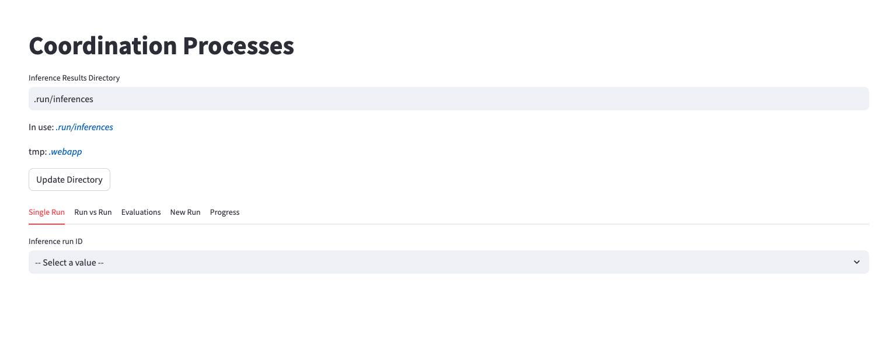
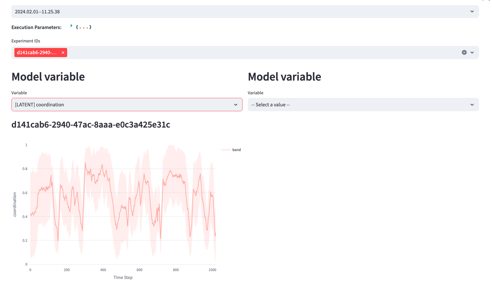
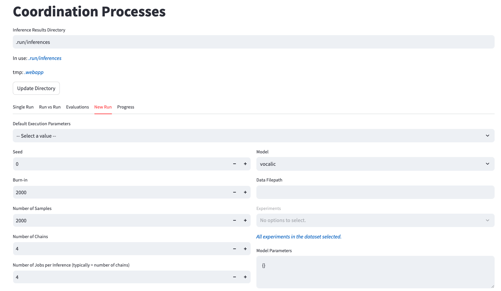
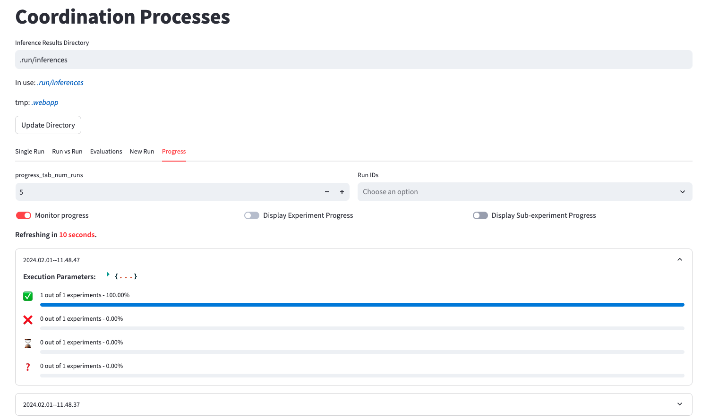

# Probabilistic Modeling of Interpersonal Coordination Processes

## Requirements

### Installation Instructions

To set up the necessary environment, execute the following command:

```bash
pip install -r requirements.txt
```

**Note**: If you plan to run multiple experiments concurrently, ensure that both TMUX and Conda are installed on your system. All dependencies should be configured within a Conda environment named `coordination`.

## Modules Overview

This project is structured around modular components that define and assemble specific instances of coordination models. For example, to build a model with constant coordination and serialized latent components, you would integrate the following modules: `ConstantCoordination`, `SerialGaussianLatentComponent`, and `SerialGaussianObservation`.

You can find a detailed list of available modules in the `coordination/module` directory.

### Coordination Modules

Located within the `coordination/module/coordination` directory, these modules are foundational for building coordination models.

#### ConstantCoordination

This module represents a coordination variable that remains constant over time.

#### SigmoidGaussianCoordination

This module models coordination as a variable that undergoes Gaussian transitions followed by a sigmoid transformation, ensuring the coordination values stay within the range $[0,1]$. The model equations are:

```math
\begin{align}
u_t \sim \mathcal{N}(u_{t-1},\sigma^2_c)\\
C_t = \text{sigmoid}(u_t),
\end{align}
```

where $u_t$ is an auxiliary variable representing an unbounded coordination value.

### Latent System Components

The modules related to latent components are housed within the `coordination/module/latent_component` directory.

For clarity, we denote $c = C_{f^{n,p}(t)}$ in the subsequent formulas.

#### SerialGaussianLatentComponent

This component models pairwise interaction dynamics using a Gaussian random walk, ideal for data that occurs in a serial, turn-taking manner, such as conversational dynamics.
```math
A^{n,p}_t \sim \mathcal{N}((1-c)A^{n,p}_{t-1} + cA^{n,p'}_{t-1}, \sigma^{2}_{A^{n,p}}), ~\text{for}~ p \neq p'.
```

#### Serial2DGaussianLatentComponent

A specific instance of the `SerialGaussianLatentComponent`, fixed to two dimensions—position and velocity—this component follows Newtonian dynamics moderated by coordination:
```math
\begin{align}
S_t &= A^{n,p}_{t-1}[0] + A^{n,p}_{t-1}[1] \\
V_t &= (1-c)A^{n,p}_{t-1}[1] + cA^{n,p'}_{t-1}[1]\\             
A^{n,p}_t &\sim \mathcal{N}\left(\left[\begin{matrix}S_t\\V_t\end{matrix}\right], \sigma^{2}_{A^{n,p}}\right), ~\text{for}~ p \neq p
\end{align}
```

#### NonSerialGaussianLatentComponent

Designed for multi-party interactions, this component's dynamics are defined by a Gaussian random walk suitable for regularly intervalled data such as neural or physiological measures:
```math
A^{n,p}_t \sim \mathcal{N}((1-c)A^{n,p}_{t-1} + \frac{c}{|P|-1}\sum_{p' \in P-\{p\}}A^{n,p'}_{t-1}, \sigma^{2}_{A^{n,p}}),
```
where $P$ represents the group of individuals.

#### NonSerial2DGaussianLatentComponent

An adaptation of the `Serial2DGaussianLatentComponent` for non-serial interactions.

#### NullLatentComponent

A placeholder component used with observations that directly depend on the coordination variable, such as `SpikeObservation`.

### Observations

Observation modules reside within the `coordination/module/observation` directory.

#### SerialObservation

Observations derived from a Gaussian distribution centered on the serial latent component.
```math
O^{n,p}_t \sim \mathcal{N}(A^{n,p}_t,\sigma^2_{O^{n,p}})
```

#### NonSerialObservation

Adaptation of `SerialObservation` for non-serial contexts.

#### SpikeObservation

Designed for sparse binary observations (e.g., semantic links), this module samples from a normal distribution centered at coordination values.
```math
O^{n,p}_t \sim \mathcal{N}(C_t,\sigma^2_{O^{n,p}})
```
This must be paired with the `NullLatentComponent` for correct use.

### Transformations

Transformation modules, located in the `coordination/module/transformation` directory, adjust the dimensions or properties of latent components before they influence observations.

### DimensionReduction

This transformation allows selecting specific dimensions from the latent component vector $A_t$ to align with the dimensions required by the observation vector $O_t$. For instance, when modeling neural data with a single-channel observation, where $O_t$ is one-dimensional and $A_t$ from a `NonSerial2DGaussianLatentComponent` is two-dimensional, direct sampling isn't feasible due to the dimensional mismatch. `DimensionReduction` is employed to choose a suitable single dimension (e.g., position) from $A_t$, facilitating the allowing of $O_t$ based on this selected dimension.

### MLP

The MLP module uses a neural network architecture to transform the latent component vector $A_t$ before it is used to sample the observation vector $O_t$. This setup allows for the mapping of a latent component with any number of dimensions to an observation vector of any dimensions, thereby accommodating complex model structures and supporting the modeling of non-linear dependencies between latent and observed variables. 

**Notes:**
- The MLP's weights are subjected to a Gaussian prior, which introduces regularization and helps in managing overfitting.
- Currently, the bias term in the MLP is not implemented, which might affect the flexibility and the shifting ability of the model.

#### Sequential

A composite transformation allowing a sequence of transformations. For example, reducing dimensionality with `DimensionReduction` followed by scaling with an `MLP` can tailor the latent dimension to fit multi-dimensional observational needs.

A typical use case for combining DimensionReduction and MLP transformations is when we want to derive multiple observation channels from a single dimension of the latent component. For example, if instead of one channel, we have 10 channels for observations, we start by using `DimensionReduction` to select the position dimension from $A_t$. This selected dimension is then fed into an `MLP` configured with fixed unitary weights to generate a 10-dimensional vector. This vector forms the basis from which all dimensions of $O_t$ are sampled, allowing each of the 10 channels to be influenced by the same underlying feature from $A_t$.

### Component Group Overview

A component group in this framework consists of a latent component, a series of observations, and an optional list of transformations. Essential to the model construction is a coordination component, which links to various groups such as vocalic, semantic links, or neural activity. All observations within a group derive their data from the same latent component, which may be modified by any transformations included in the group.

## Models

The concrete model implementations are found under `coordination/model/real`. Presently, there are two primary models: one tailored for vocalic and potentially semantic link observations (VocalicModel), and another designed for fNIRS and optionally GSR, vocalic, and semantic link observations (BrainModel).

### Model Inheritance and Construction

All models inherit from the `ModelTemplate` and feature a constructor that accepts two parameters: a config bundle and an optional PyMC model (created by default if not provided).

### Config Bundle

The config bundle is a crucial aspect, structured as a dataclass that encapsulates all necessary parameters to customize the model. Each model, such as the VocalicModel and BrainModel, has its own specific config bundle located in `coordination/model/config_bundle`. 

This structured approach not only maintains a clean model interface but also facilitates the straightforward setting of model parameters, either via a JSON file when running inferences through a command line or a web interface. 

#### Example Configuration

For instance, the configuration for our vocalic model is stored in `data/vocalic/config/params/vocalic_params_dict.json`, outlined below:

```json
{
  "sd_mean_uc0": 5.0,
  "sd_uc": 0.5,
  "sd_o": 0.1,
  "sd_s": 5.0,
  "share_mean_a0_across_subjects": false,
  "share_mean_a0_across_dimensions": false,
  "share_sd_a_across_dimensions": false,
  "match_vocalic_scale": false,
  "observation_normalization": "norm_per_subject_and_feature"
}
```

Each key in this JSON file corresponds to a variable in the `VocalicConfigBundle` dataclass. Values specified in the JSON file override the defaults in the config bundle, ensuring that the model utilizes the updated configurations during inference.

### Data Mapping Overview

Data mapping acts as a crucial bridge between the raw data stored in CSV files and the variables defined within a model's configuration bundle. This mechanism ensures that specific columns in the data file are appropriately assigned to corresponding variables in the configuration, facilitating accurate data processing and model parameterization.

Here is an illustration of how data mapping is implemented for the vocalic model, as specified in `data/vocalic/config/mappings/vocalic_data_mapping.json`:

```json
{
  "mappings": [
    ...
    {
      "bundle_param_name": "observed_values",
      "data_column_names": ["pitch", "intensity", "jitter", "shimmer"],
      "data_type": "array"
    },
    {
      "bundle_param_name": "num_time_steps_in_coordination_scale",
      "data_column_names": ["num_time_steps_in_coordination_scale"],
      "data_type": "int"
    }
  ]
}
```

- **Mapping Definition:** Each mapping is a JSON object that connects one or more data columns (`data_column_names`) to a specific variable in the config bundle (`bundle_param_name`). Additionally, the `data_type` parameter specifies the nature of the data (e.g., array, int).

- **Array Data Handling:** For data types designated as arrays, multiple data columns can be linked to a single variable in the config bundle. These columns are then concatenated into a single tensor. For example, the `observed_values` variable would aggregate the columns for pitch, intensity, jitter, and shimmer into a 4xT tensor, where T is the number of time steps with vocalic data in a specific experiment.

- **Non-Serial Observations:** In cases like brain signals where non-serial observations are involved, each channel in the dataset is a 3xT list for three participants. If multiple channels are specified in the `data_column_names`, this results in a tensor of shape (3,C,T) within the `observed_values`, where C is the number of channels listed.

## Inference 

We have implemented a streamlined process using `make` commands to facilitate the running of inference jobs that reproduce the results presented in the ICML 2024 paper and corresponding PhD dissertation. The Makefile includes descriptive comments for each target. Additionally, these inferences can also be initiated via a web app, where results can be conveniently reviewed.

### Managing Parallel Inferences

When planning to conduct multiple inference jobs concurrently:
- Set the environment variable `N_JOBS` to divide the workload across multiple jobs.
- Each job initiates four additional processes for each chain, leading to a total computational demand of `N_JOBS * num_chains + 1` (including the main process).

**Important**: All `pytensor` objects compiled during the inferences are stored in the `.pytensor_compiles` directory at the project's root to prevent locking issues when multiple models are fitted simultaneously. Periodically clearing this directory is recommended to free up space. The storage location for these compiled objects can be altered by setting the `pytensor_comp_dir` environment variable prior to executing the `run_inference` script or using the web app.

## Replication of Results

### ICML 2024

For exact replication of the results published in ICML 2024, particularly for the Synthetic Vocalic model, refer to the notebooks located at `notebooks/Synthetic Vocalic`. The specific `make` commands for the Vocalic model are detailed in the Makefile.

#### Citation
Please cite our work as follows if you utilize our model or reproduce our results:
```
@InProceedings{soares2024coordination,
  title = {Probabilistic Modeling of Interpersonal Coordination Processes},
  author = {Paulo Soares and Adarsh Pyarelal and Meghavarshini Krishnaswamy and Emily Butler and Kobus Barnard},
  booktitle = {Proceedings of the 41st International Conference on Machine Learning},
  year = {2024}
}
```

### Additional Experiments

For experiments involving brain data, execute the `make` commands specified for the Brain model. These results are detailed in the PhD dissertation cited below:
```
@phdthesis{soares2024phddissertation,
  title = {Probabilistic Modeling of False Beliefs and Team Coordination},
  author = {Paulo Soares},
  year = {2024},
  school = {University of Arizona},
  address = {Tucson, USA},
  url = {https://repository.arizona.edu/handle/10150/672614}
}
```

## Data Management

All experimental data are stored under the `data/` directory at the root of the project. This directory contains essential configurations for:
1. Overriding the default values in the config bundle with experiment-specific parameters (e.g., `data/vocalic/config/params/vocalic_params_dict.json`).
2. Mapping data columns to specific fields in the model's config bundle (e.g., `data/vocalic/mappings/vocalic_data_mapping.json`), ensuring precise and accurate data handling for each model run.

## Webapp

The project provides a webapp to execute new runs, monitor the progress of such runs and see results of inference jobs (see images below).

To start the app in the port 8080, do:
```
APP_PORT=8080 make app
```

It is possible to run it in a remote server and access it locally via port forwarding. By default, inferences will be saved in the directory `.run/inferences` but one can change that path in the app or via one of the environment variables described below:

- **inferences_dir**: directory where inferences must be saved.
- **data_dir**: directory where datasets are located. 
- **evaluations_dir**: directory where evaluations are located. Every time we run an inference run, it will generate a unique ID (timestamp). Traces will be saved under `$inferences_dir/run_id`. We can add extra evaluation objects (.csv and png) in another directory with the format `$EVAL_DIR/run_id` and they will be available in the Evaluations tab in the app.  






## License

MIT License - Copyright (c) 2023
